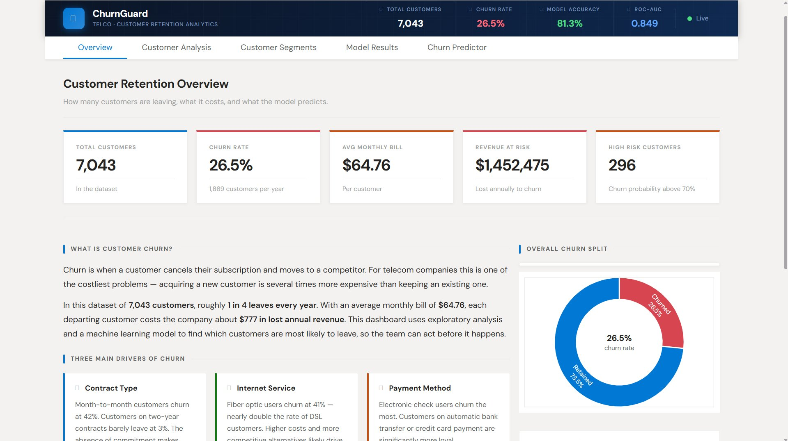
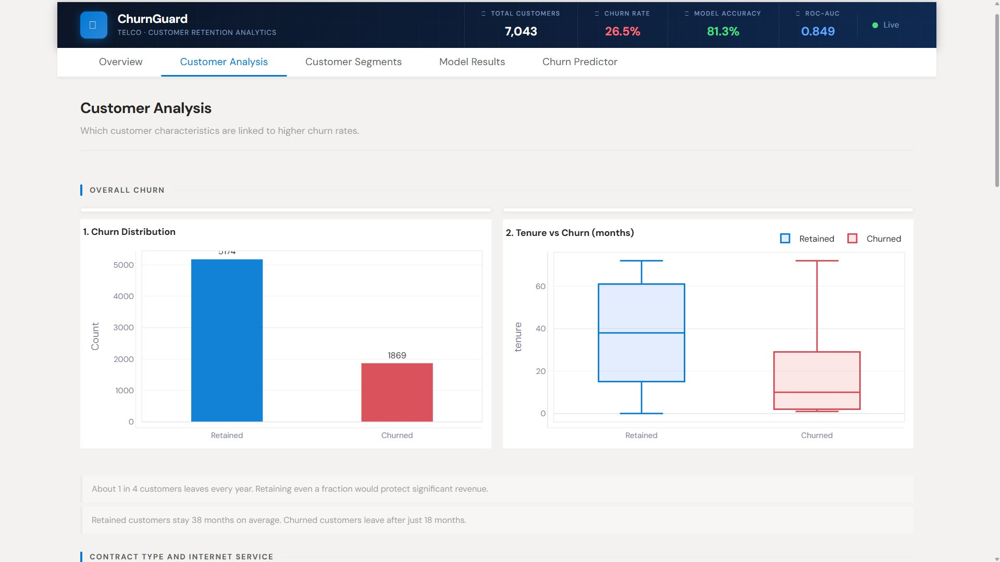
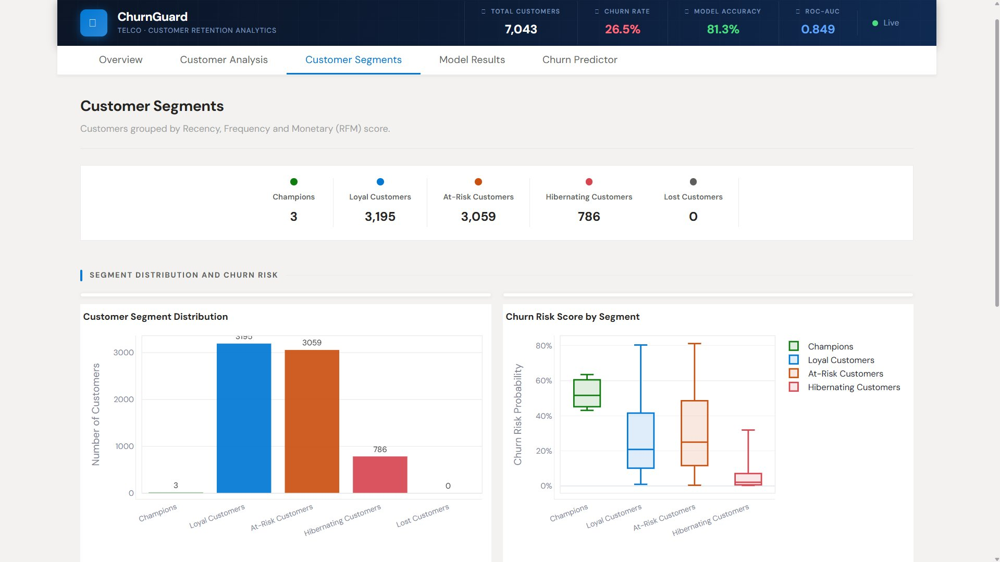
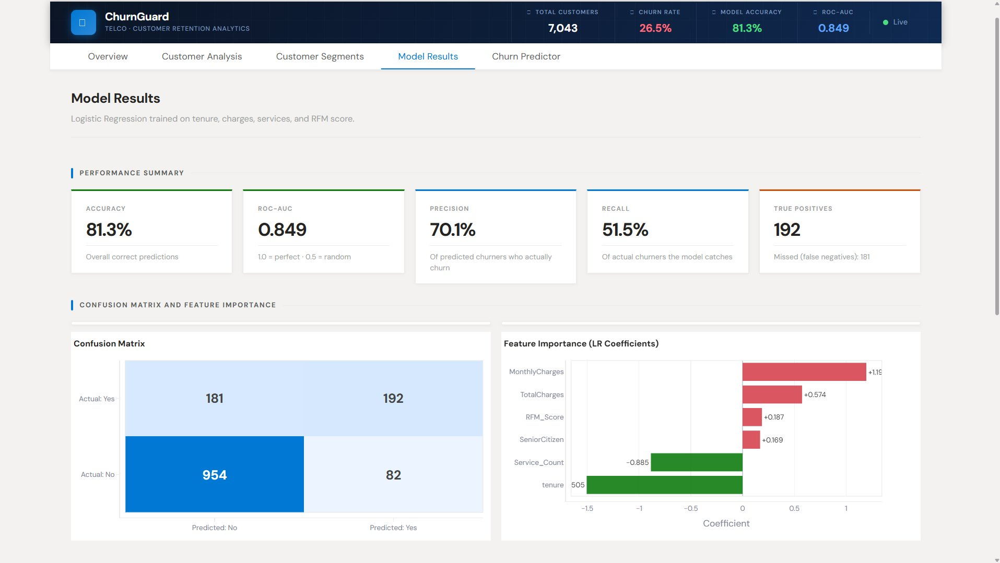
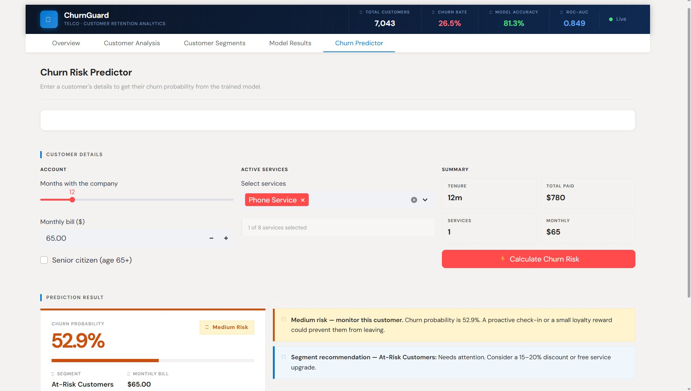

# ChurnGuard — Telco Customer Churn Dashboard


A simple **machine learning dashboard** that analyzes telecom customer data and predicts the probability of churn.

The project includes **data cleaning, exploratory analysis, RFM segmentation, model evaluation, and an interactive Streamlit dashboard**.

---

### Live Demo -> https://churnanalysisand-prediction-005.streamlit.app

---

## Features

- Customer churn prediction using **Logistic Regression**
- Interactive **Streamlit dashboard**
- **EDA charts** with Plotly
- **RFM customer segmentation**
- **Model evaluation** (Confusion Matrix and ROC Curve)
- **Single customer churn prediction tool**

 ---

## Overview

<table width="100%">
<tr>
<td align="center" width="50%">

**Overview**



</td>
<td align="center" width="50%">

**Customer Analysis**



</td>
</tr>

<tr>
<td align="center" width="50%">

**Customer Segments**



</td>
<td align="center" width="50%">

**Model Results**



</td>
</tr>

<tr>
<td align="center" colspan="2">

**Churn Predictor**



</td>
</tr>
</table>

---

## Project Structure

```
churnguard/
├── app.py                  # Main entry point — page config, header, tab routing
├── data.py                 # Data loading, cleaning, feature engineering
├── model.py                # Model training, evaluation, prediction logic
├── ui.py                   # Reusable HTML/CSS component functions
├── page_overview.py        # Tab 1 — KPIs, churn context, model summary
├── page_analysis.py        # Tab 2 — EDA charts (8 Plotly figures)
├── page_segments.py        # Tab 3 — RFM segmentation charts
├── page_model.py           # Tab 4 — Confusion matrix, ROC, feature importance
├── page_predict.py         # Tab 5 — Single customer churn predictor
├── Telco-Customer-Churn.csv
├── requirements.txt
└── .streamlit/
    └── config.toml         # Theme configuration
```

---

## Key Concepts 

### Why Logistic Regression?

Logistic Regression outputs a probability between 0 and 1, which is exactly what churn prediction needs — not just a yes/no answer, but a risk score that can be thresholded at different levels depending on the cost of intervention. It is also fully interpretable: each coefficient directly tells you how much a one-unit change in that feature shifts the log-odds of churn.

### What is RFM Scoring?

RFM stands for Recency, Frequency, and Monetary value. In this telecom context:

- **Recency** = how long the customer has been with the company (tenure in months)
- **Frequency** = how many services they use (phone, internet, streaming, etc.)
- **Monetary** = their total charges to date

Each dimension is scored 1–5 using quantile ranking. The three scores are summed to produce a single RFM score (3–15). Customers are then bucketed into segments: Champions (13+), Loyal (10–12), At-Risk (7–9), Hibernating (4–6), Lost (3 and below).

### Why Does ROC-AUC Matter More Than Accuracy?

The dataset is imbalanced: 73.5% of customers did not churn. A model that predicts "no churn" for everyone would be 73.5% accurate while being completely useless. ROC-AUC measures the model's ability to separate churners from non-churners regardless of the decision threshold — a score of 0.85 means the model correctly ranks a random churner above a random non-churner 85% of the time.

### The Confusion Matrix

```
                  Predicted: No    Predicted: Yes
Actual: No             TN               FP
Actual: Yes            FN               TP
```

- **True Positives (TP)**: customers correctly flagged as churners — these are the ones you can act on
- **False Negatives (FN)**: churners the model missed — the most costly error
- **False Positives (FP)**: false alarms — loyal customers incorrectly flagged

For a retention campaign, missing a churner (FN) is usually more expensive than a false alarm (FP), so improving recall is often the business priority.


---

## Model Features Used for Training

```python
FEATURES = [
    "tenure",           # How long they have been a customer
    "MonthlyCharges",   # Current monthly bill
    "TotalCharges",     # Cumulative spend
    "SeniorCitizen",    # Binary demographic flag
    "Service_Count",    # Engineered feature — service breadth
    "RFM_Score",        # Engineered feature — combined loyalty score
]
```

---

## Setup and Installation

**Requirements:** Python 3.9 or higher

```bash
# 1. Clone the repository
git clone https://github.com/your-username/churnguard.git
cd churnguard

# 2. Install dependencies
pip install -r requirements.txt

# 3. Place the dataset
# Put Telco-Customer-Churn.csv in the same folder as app.py

# 4. Run the app
streamlit run app.py
```

The dataset is available publicly on Kaggle: [Telco Customer Churn](https://www.kaggle.com/datasets/blastchar/telco-customer-churn)

---

## Requirements

```
streamlit>=1.32.0
pandas>=2.0.0
numpy>=1.24.0
scikit-learn>=1.3.0
plotly>=5.18.0
```

---

## Streamlit Theme Configuration

Create `.streamlit/config.toml` in your project root:

```toml
[theme]
base                     = "light"
backgroundColor          = "#F3F2F1"
secondaryBackgroundColor = "#FFFFFF"
textColor                = "#252423"
primaryColor             = "#0078D4"
font                     = "sans serif"
```

---

## Churn Driver Summary

Based on the EDA, three variables have the strongest relationship with churn:

| Driver | Churners | Retained | Takeaway |
|---|---|---|---|
| Month-to-month contract | 42% churn | 11% churn | Long-term contracts lock in customers |
| Fiber optic internet | 41% churn | 19% churn | Higher cost drives more switching |
| Electronic check payment | 45% churn | 15% churn | Auto-pay customers are more committed |

---

## Segment Action Guide

| Segment | RFM Score | Churn Risk | Recommended Action |
|---|---|---|---|
| Champions | 13–15 | Very Low | Loyalty rewards and early renewal offers |
| Loyal Customers | 10–12 | Low | Contract upgrade incentives and bundles |
| At-Risk Customers | 7–9 | Medium | Proactive outreach — 15 to 20% discount |
| Hibernating Customers | 4–6 | High | Win-back campaign with limited-time offer |
| Lost Customers | 3 | Very High | Immediate contact with strong incentive |

---

 
